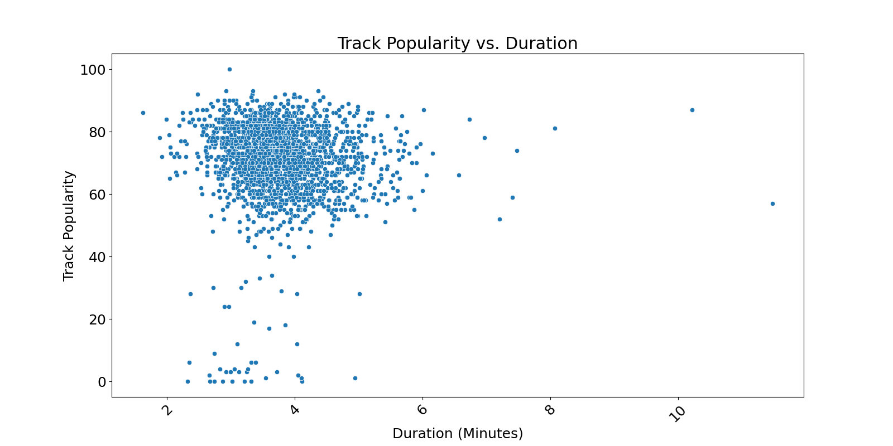

# Continuous Integration using GitHub Actions of Python

### Purpose
This repo demonstrates the power github actions for automating your CICD workflow using `yml` files.

### `src` directory:
1. `lib.py` This is the main library and it contains functions to reads a CSV, manipulate, calculates descriptive statistics for specified or all numeric columns. 
2. `analysis.ipynb` Notebook that utilises the lib file to perform analysis.
3. `further_clean_save_json.py` Python script that also utilises the lib functions

### Test script:
1. `test_lib.py` and `test_script.py` Comprehensive test cases to help ensure that the descriptive_statistics and manipulation function behaves as expected when given different inputs

### Infrastructure scripts:
`.devcontainer`
1. `devcontainer.json` Sets up a development environment. It also includes settings for Docker for VS Code or GitHub Codespace. 
2. `Dockerfile` Dockerfile set up a development environment with Python 3.8

`Makefile` Streamlines development workflows and ensuring code quality and consistency. Example Usuage is illustrated in 
[this Gist](https://gist.github.com/markoke/1b98b6254c1aadbc6e7e7c9421c36846).

#### Plots insights 

## DEMO VIDEO

You can watch the demo video [here](https://www.youtube.com/watch?v=6vxBJy8y8Ms).

